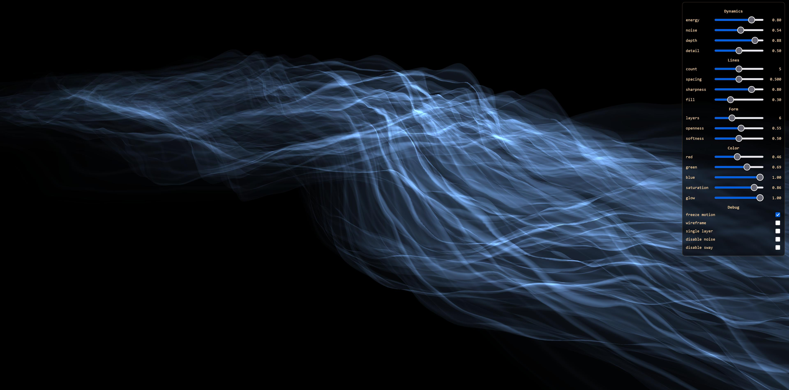

# Waves Visualizer

A simple Three.js experiment for visualizing emotions as overlapping animated waves.

**Note: This is a vibe-coded project. The majority of the code was generated with copilot.**



## Python Server

Start the server:
```bash
python server.py
```
Open `http://localhost:8000` in your browser.

## API POST Example

Send a POST request to update the visualization parameters:
```bash
curl -X POST http://localhost:8000/api/update -H "Content-Type: application/json" -d "{\"energy\": 0.8, \"turbulence\": 0.7, \"red\": 0.9}"
```

## Parameters

* `energy`: Wave movement speed and amplitude. Range `0 to 1`.
* `turbulence` (noise): Noise distortion applied to the waves. Range `0 to 1`.
* `depth`: The 3D depth wave effect. Range `0 to 1`.
* `detail`: Filament count and sharpness. Range `0 to 1`.
* `openness`: Phase offsets and line tilt. Range `0 to 1`.
* `softness`: Level of smoothness of waves. Range `0 to 1`.
* `lineCount`: Number of lines. Range `1 to 5` (integers).
* `lineSpacing`: Spacing between lines. Range `0 to 1`.
* `lineSharpness`: Sharpness of lines. Range `0 to 1`.
* `lineFill`: Thickness/fill of lines. Range `0 to 1`.
* `red`, `green`, `blue`: Primary RGB components. Range `0 to 1`.
* `saturation`: Color saturation. Range `0 to 1`.
* `glow`: Brightness and opacity multiplier. Range `0 to 2`.
* `shimmerAmount`: Dynamic brightness variations. Range `0 to 1`.